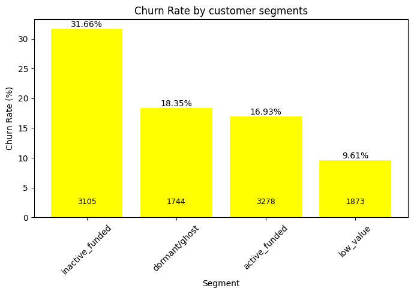

# Bank Customer Churn Analysis (SQL & Python)
---
## Overview
This project analyzes customer churn behavior for a retail bank using SQL-based exploratory and segmentation analysis.  
The goal is to identify key drivers of churn, detect high-risk customer segments, and quantify potential revenue loss due to customer exits.

Customer churn directly impacts a bank’s deposits, revenue, and long-term customer value.  
This analysis aims to understand:
- Which customers are most likely to churn?
- What demographic and behavioral factors influence churn?
- Which high-value customers are at risk?
- How much financial value is lost due to churn?

---
## Objectives of Analysis
The analysis aimed to:
1. Calculate overall churn rate
2. Identify churn patterns across geography and demographics
3. Analyze the impact of engagement and product ownership
4. Detect high-value customers at risk of leaving
5. Estimate financial loss due to churn
6. Build actionable customer risk segments

---
## Dataset Description
The dataset contains customer-level banking information, including:

- **Demographics:** Age, Gender, Geography  
- **Financial Metrics:** Balance, Estimated Salary, Credit Score  
- **Relationship Attributes:** Tenure, Number of Products, Card Type  
- **Engagement Indicators:** Active Member status, Complaint flag  
- **Target Variable:** `Exited` (Customer churn indicator)

**Total Records:** 10,000 customers

refer to: `data/readme.md`

---

## Methodology
The project followed a structured SQL-based analytical workflow:

1. Data validation and integrity checks  
2. Overall churn rate calculation  
3. Segmentation analysis across:
   - Geography
   - Gender
   - Age groups
   - Product ownership
   - Activity status  
4. Financial risk analysis:
   - Funded vs unfunded customers
   - High-balance churn patterns  
5. Complaint impact evaluation  
6. Customer segmentation based on engagement and balance  
7. Revenue impact analysis using churned balances  

All analysis was performed using SQL queries.
---

## Key Insights

Report File: [`report-pdf.pdf`](report-pdf.pdf)
Analysis File (SQL): [`churn_analysis_sql.sql`](churn_analysis_sql.sql)  
Visualisations: [`bank_churn_visuals.ipynb`](bank_churn_visuals.ipynb)

### Regional Churn Risk
Germany shows significantly higher churn (~32%) compared to France and Spain (~16–17%), indicating a regional retention issue.

### Demographic Risk Patterns
Customers aged **46–65** exhibit the highest churn rates, suggesting mid-to-late lifecycle disengagement.

### Product Ownership Effect
Customers holding exactly **2 products** have the lowest churn rates, indicating an optimal engagement.

### Engagement Matters
Inactive customers churn at much higher rates than active members, highlighting disengagement as a strong churn signal.

### High-Value Customer Risk
High-balance customers, especially in Germany, show elevated churn rates, indicating potential loss of valuable deposits.

### Complaint as a Critical Indicator
Customers who raise complaints show an extremely high probability of churn, suggesting ineffective service recovery.

### Financial Impact
Significant customer balances are lost due to churn, particularly within high-value regional segments.

#### key-visualisation:

---

## Customer Segmentation
Customers were segmented based on engagement and balance:
- **Active Funded:** Active members with positive balance (stable segment)  
- **Inactive Funded:** High-value but disengaged customers (high churn risk)  
- **Dormant/Ghost:** Inactive customers with zero balance  
- **Low Value:** Customers with minimal engagement or financial contribution  

This segmentation can be helpful in prioritising retention strategies effectively.

---

## Recommendations:

1. **Focus on Germany Market**  
   Implement targeted retention campaigns for high-value customers in Germany.

2. **Strengthen Complaint Resolution Process**  
   Customers who complain are highly likely to churn; rapid service recovery is essential.

3. **Promote Multi-Product Adoption**  
   Encourage customers to adopt a second product to improve engagement and retention significantly. 

4. **Monitor Inactive Funded Customers**  
   These customers hold high balances but show disengagement; active outreach is required.

5. **Age Group Based Retention Strategy**  
   Special retention programs should target customers aged 46–65, where churn risk is highest.

---

## Tech Stack
- SQL (PostgreSQL)
- Python (pandas, matplotlib for visualisations)

---

## Project Outcome
This analysis demonstrates how SQL-based segmentation can identify high-risk and high-value customer groups, enabling targeted retention strategies and reducing potential financial loss due to churn.

---

## Author
*Pavni Rastogi*

