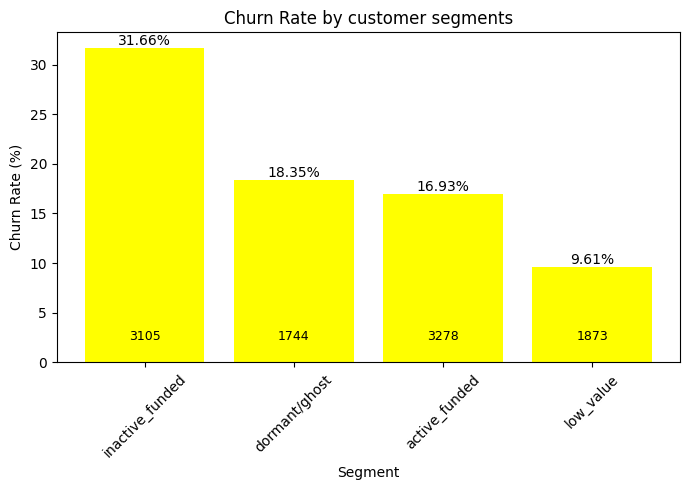

# Bank Customer Churn Analytics & Predictive Retention System

### Overview
An end-to-end data analytics and machine learning project that combines **SQL-based business analysis, predictive modeling, explainable AI, interactive dashboards, and deployment** to help financial institutions proactively identify customers at risk of churn and support data-driven retention strategies.
The goal is to identify key drivers of churn, detect high-risk customer segments, and quantify potential revenue loss due to customer exits.

The solution combines:
- SQL first business analysis
- Python-based exploratory data analysis
- Predictive machine learning
- Validated analytical insights using predictive modelling 
- SHAP explainability for model predictions
- Power BI executive dashboards
- Interactive Streamlit deployed Application

---

### Business Problem

Banks lose significant revenue when valuable customers leave without early intervention.

Traditional reporting identifies churn after it has already occurred, making proactive retention difficult.

This project addresses that challenge by helping business teams answer questions such as:

- Which customers are most likely to churn?
- Which customer segments contribute the highest financial risk?
- What factors influence churn decisions?
- How can customer risk be prioritized?
- Which customers require immediate retention efforts?

---

### Objectives of Analysis:

- Analyze customer churn patterns using SQL
- Detect high-value customers at risk of leaving
- Understand demographic and behavioral drivers of churn
- Build predictive churn models
- Explain model predictions using SHAP
- Generate customer risk scores
- Build actionable customer risk segments and Recommend retention actions
- Build an interactive business application for real-time customer scoring

click here to access deployed web application:
#### [Customer Churn Intelligence Application]()


---

## Key Insights

<<<<<<< HEAD
summary:
| Area | Key Finding | Business Action |
|---|---|---|
| Geography | Germany churns at ~32% | Prioritize German retention campaigns |
| Engagement | Inactive funded customers churn most | Trigger outreach for high-balance inactive users |
| Products | 2-product customers churn least | Promote second-product adoption |

Report File: [`report-pdf.pdf`](report-pdf.pdf)
Analysis File (SQL): [`churn_analysis_sql.sql`](churn_analysis_sql.sql)  
Visualisations: [`bank_churn_visuals.ipynb`](bank_churn_visuals.ipynb)


### Regional Churn Risk
Germany shows significantly higher churn (~32%) compared to France and Spain (~16–17%), indicating a regional retention issue.

### Demographic Risk Patterns
Customers aged **46–65** exhibit the highest churn rates, suggesting mid-to-late lifecycle disengagement.

### Product Ownership Effect
Customers holding exactly **2 products** have the lowest churn rates, indicating an optimal engagement.

### Engagement Matters
Inactive customers churn at much higher rates than active members, highlighting disengagement as a strong churn signal.

### High-Value Customer Risk
High-balance customers, especially in Germany, show elevated churn rates, indicating potential loss of valuable deposits.

### Complaint as a Critical Indicator
Customers who raise complaints show an extremely high probability of churn, suggesting ineffective service recovery.

### Financial Impact
Significant customer balances are lost due to churn, particularly within high-value regional segments.

#### key-visualisation:

=======
- Germany shows significantly higher churn (~32%) compared to France and Spain (~16–17%), indicating a regional retention issue.

- Customers aged **46–65** exhibit the highest churn rates, suggesting mid-to-late lifecycle disengagement.

- Customers holding exactly **2 products** have the lowest churn rates, indicating an optimal engagement.

- Inactive customers churn at much higher rates than active members, highlighting disengagement as a strong churn signal.

- High-balance customers, especially in Germany, show elevated churn rates, indicating potential loss of valuable deposits.

- Customers who raise **complaints** show an extremely high probability of churn, suggesting ineffective service recovery.

- Significant customer balances are lost due to churn, particularly within high-value regional segments.


Descriptive Analysis Report File: [`report-pdf.pdf`](readme-assets/report-pdf.pdf)
Analysis File (SQL): [`churn_analysis_sql.sql`](churn_analysis_sql.sql)  
Power BI dashboard: [`dashboard`](dashboard.pbix)
Prediction Application Live link: [`Streamlit Deployed Application`]()
>>>>>>> b5230fe (added predictive churn modelling)

---

### Project Workflow:

1. SQL Based Business Analysis:

<details>

Performed comprehensive SQL analysis to understand customer churn patterns after data aduting & validation.

Analysis included:

- Overall churn rate
- Country-wise churn
- Gender analysis
- Age segmentation
- Product ownership
- Active member analysis
- Balance analysis
- High-value customer identification
- Complaint analysis
- Customer segmentation
- Revenue impact assessment

**SQL based Customer Segmentation (before predictive modelling):**

Customers were segmented based on engagement and balance:

- **Active Funded:** Active members with positive balance (stable segment)  
- **Inactive Funded:** High-value but disengaged customers (high churn risk)  
- **Dormant/Ghost:** Inactive customers with zero balance  
- **Low Value:** Customers with minimal engagement or financial contribution  

This segmentation can be helpful in prioritising retention strategies effectively.

</details>

2. Python EDA 

<details>

Performed detailed exploratory analysis using Python.

Key analyses included:

- Target distribution
- Feature distributions
- Correlation analysis
- Box plots
- Histograms
- Churn comparisons
- Feature relationships

</details>

3. Data Pre-Processing 

</details>

The preprocessing pipeline included:

- Missing value validation
- Binary encoding
- Label encoding
- One-hot encoding
- Feature selection
- Feature ordering
- Model-ready dataset generation

</details>

4. Trained Machine Learning Models: Logistic Regression, Decision Tree, Random Forest

<details>

Multiple classification models were trained and compared.

Models evaluated:

- Logistic Regression
- Logistic Regression (Balanced)
- Decision Tree Classifier
- Random Forest Classifier

The Random Forest model achieved the best balance between predictive performance and business interpretability.

**Model Performance:**

| Model | Accuracy | Precision | Recall | F1 Score | ROC-AUC |
|-------|---------:|----------:|-------:|---------:|---------:|
| Logistic Regression (All Features) | **0.9985** | **0.997543** | **0.995098** | **0.996319** | **0.999246** |
| Logistic Regression (Without `complain`) | 0.8130 | 0.623188 | 0.210784 | 0.315018 | 0.778839 |
| Logistic Regression (Balanced, Without `complain`) | 0.7130 | 0.390212 | 0.723039 | 0.506873 | 0.780151 |
| Decision Tree (Without `complain`) | 0.8545 | 0.777251 | 0.401961 | 0.529887 | 0.851147 |
| **Random Forest (Without `complain`)** | **0.8680** | **0.827273** | **0.446078** | **0.579618** | **0.870290** |


Note: ```Complain``` column was used initially to train Logistic Regression which gave a perfect prediction model since it was the most impactful factor driving churn, indicating customers who made a complain, churned at 99.5% rate. But it was often a last stage indicator and made model unrealistically perfect, so to make prediction better, other models were trained without this column and Random Forest performed best amongst these. 

The Random Forest model trained without this feature was selected for deployment as it provides a more realistic evaluation of customer churn prediction.

</details>

5. SHAP Explainability

<details>

Rather than treating the model as a black box, SHAP was used to explain individual customer predictions.

The application provides:

- Local SHAP waterfall plots
- Feature contribution analysis
- Plain-English explanation of prediction drivers
- **Customer-specific risk & churn drivers interpretation**

This allows business users to understand **why** a customer was classified as high or low risk.


</details>


6. Risk Scoring & Customer Segmentation

<details>

Predicted churn probabilities are converted into a business-friendly **Risk Score (0–100)**.

Customers are segmented into:

| Risk Level | Score |
|------------|-------|
| Low Risk | 0–30 |
| Medium Risk | 31–60 |
| High Risk | 61–100 |

Recommended retention actions are automatically generated based on customer risk.

</details>

7. Power BI dashboard

<details>

The project includes two interactive dashboards.

**Business Analytics Dashboard**

Includes:

- Overall churn KPIs
- Geography analysis
- Age segmentation
- Product analysis
- Active member analysis
- Customer recommendations

**Predictive Analytics Dashboard**

Includes:

- Average churn probability
- Risk score distribution
- High-risk customers
- Customer risk segmentation
- Country-wise risk analysis
- Retention candidate analysis

</details>

8. Streamlit Decision Support Application

<details>

A production-style Streamlit application was developed to simulate an internal customer retention system.

Features include:

- Customer profile input
- Real-time churn prediction
- Risk score calculation
- Customer risk categorization
- Retention recommendations
- Interactive risk gauge
- SHAP explainability with waterwall plot
- As well as plain-english prediction explanations

</details>

--- 

## Recommendations:

1. **Focus on Germany Market**  
   Implement targeted retention campaigns for high-value customers in Germany.

2. **Strengthen Complaint Resolution Process**  
   Customers who complain are highly likely to churn; rapid service recovery is essential.

3. **Promote Multi-Product Adoption**  
   Encourage customers to adopt a second product to improve engagement and retention significantly. 

4. **Monitor Inactive Funded Customers**  
   These customers hold high balances but show disengagement; active outreach is required.

5. **Age Group Based Retention Strategy**  
   Special retention programs should target customers aged 46–65, where churn risk is highest.

---

## Dataset Description

Raw dataset: 

The dataset contains customer-level banking information, including:

- **Demographics:** Age, Gender, Geography  
- **Financial Metrics:** Balance, Estimated Salary, Credit Score  
- **Relationship Attributes:** Tenure, Number of Products, Card Type  
- **Engagement Indicators:** Active Member status, Complaint flag  
- **Target Variable:** `Exited` (Customer churn indicator)

**Total Records:** 10,000 customers

for more information, refer to: `data/readme.md`


Processed dataset:

The processed dataset was cleaned and transformed into a machine learning-ready format through binary encoding, label encoding, one-hot encoding, feature selection, and removal of identifier columns while preserving the exact feature order required for model training and inference.

`customerid`, `rownumber`, `surname` were dropped to prevent data leakage. 


- SQL Query Concepts Used

This project uses SQL to perform data validation, exploratory analysis, customer segmentation, and churn risk analysis. Key SQL concepts used include:

- **Aggregate Functions:** Used `COUNT()`, `AVG()`, `SUM()`, `MIN()`, and `MAX()` to calculate churn rates, customer counts, balance totals, and numeric ranges.
- **GROUP BY:** Segmented customers by geography, gender, age group, product ownership, activity status, complaint status, and balance category.
- **CASE Statements:** Created custom customer segments such as age groups, balance buckets, and risk-based customer categories.
- **Common Table Expressions (CTEs):** Used `WITH` clauses to structure intermediate segmentation logic before calculating churn rates.
- **Conditional Filtering:** Used `WHERE` conditions to isolate high-risk groups such as inactive funded customers, German customers, churned customers, and high-balance customers.
- **Boolean Logic:** Analyzed binary fields such as `Exited`, `IsActiveMember`, `HasCrCard`, and `Complain`.
- **Type Casting:** Converted churn indicators using `exited::int` to calculate churn rates with `AVG()`.
- **Conditional Aggregation:** Used `FILTER` with `SUM()` to calculate churned customer balances by geography.
- **Sorting and Ranking Logic:** Used `ORDER BY` to identify highest-risk customer groups and prioritize segments.
- **Data Validation Queries:** Checked for null values, duplicate customer IDs, valid categorical values, binary column consistency, and numeric value ranges.

---

# Tech Stack:

- Data Analysis: ```PostgreSQL```, ```SQL```, ```Python```, ```Pandas```, ```NumPy```

- Machine Learning: ```Scikit-learn```, ```Random Forest```, ```Decision Tree```, ```Logistic Regression```

- Explainable AI: ```SHAP```

- Data Visualization: ```Matplotlib```, ```Seaborn```, ```Plotly```, ```Power BI```

- Deployment: ```Streamlit```, ```Joblib```

---

## Acknowledgements

This project was developed as part of a hands-on analytics portfolio to demonstrate an end-to-end customer churn solution covering business analysis, predictive modeling, explainable AI, dashboarding, and deployment.

# Future Improvements

Potential enhancements include:

- Hyperparameter optimization
- XGBoost and LightGBM comparison
- Real-time API deployment
- Automated model retraining pipeline
- Customer lifetime value prediction
- Retention campaign simulation
- MLOps integration

---

# Author

**Pavni Rastogi**


